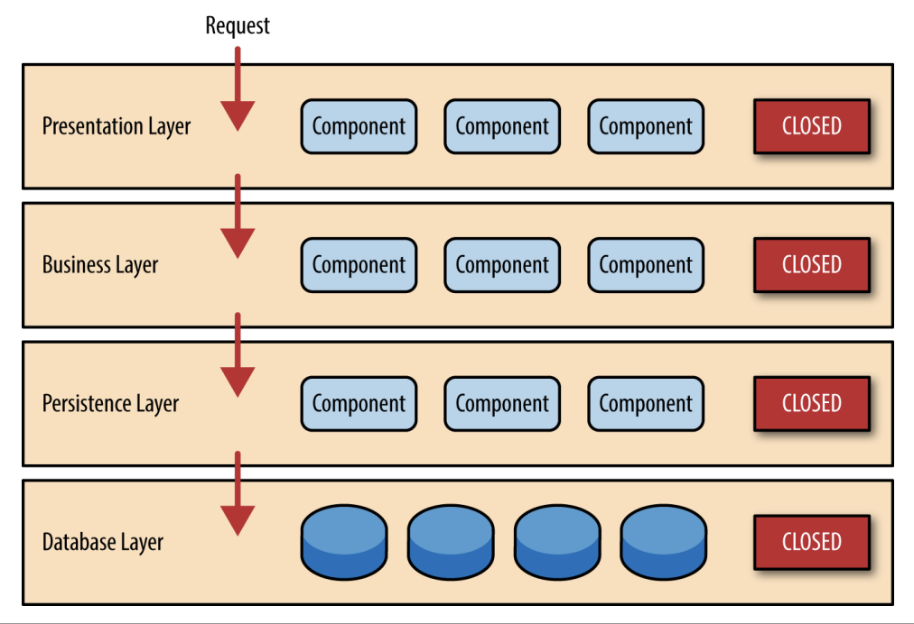
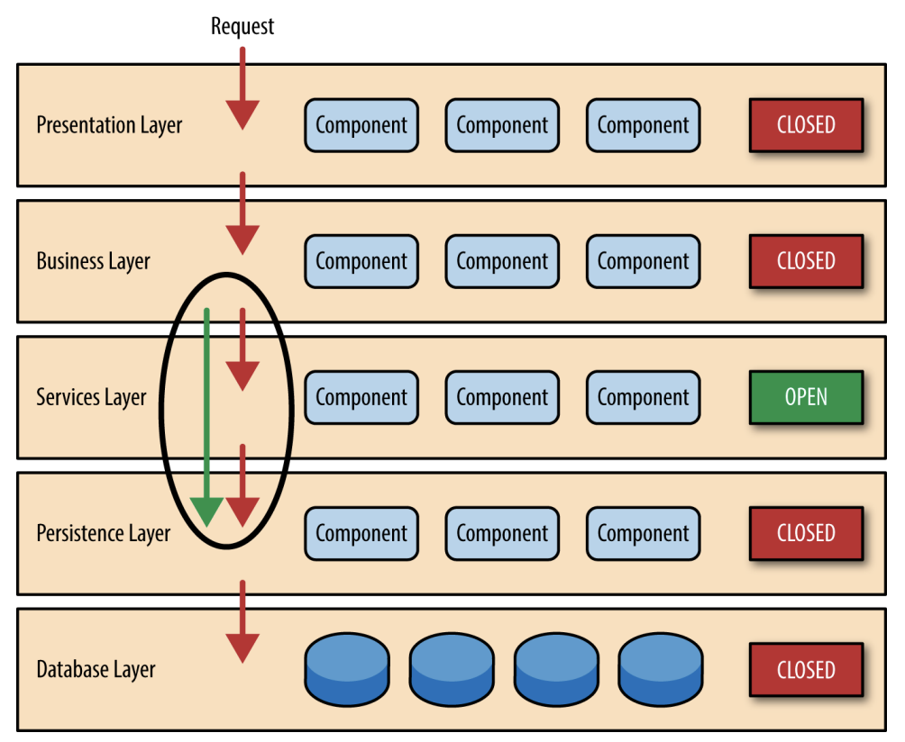

+++ 
draft = true
date = 2026-07-12T10:17:31+08:00
title = ""
description = ""
slug = ""
authors = []
tags = ["架构","技术"]
categories = []
externalLink = ""
series = []
toc = true
+++
## 概念
### 描述
分层架构（Layerd Architecture），是将应用分为多个层次，每层各自负责一个明确的职责，而请求自上而下。分层架构中每个层是独立的，层内的修改不影响到其他层，这需要每一层可以依赖下层接口但不能依赖上层，即上层调用下层，下层不知道上层存在。
常见的分层：
- Presentation UI层、负责用户界面
- Business 业务层、负责核心业务逻辑
- Persistence 持久层，提供数据和CRUD
- Database 数据库

### 核心概念
分层架构的每一层可以分为两类，CLOSED 和 OPEN。
CLOSED 表示这是一个封闭层，上层必须通过这一层。大多数层都是封闭层。
OPEN 层表示这一层开放，允许该层被跳过。例如，Business 可能有各个组件都会用到的公共组件，若放在 util ，没法约束其他层不去调用，合适的做法是在 Business 下设计一个 OPEN 的 Service 层，提供仅 Business 能用的公共组件。这样 Business 需要时可以调用 Service 也可以直接调用 Persistence。

### 注意
- 黑洞反模式（architecture sinkhole anti-pattern）：某一层只是在传递请求，而没有对数据进行处理。可以用二八定律判断，若80%的请求只是在透穿，20%请求有处理逻辑，那么该层就存在黑洞反，可以考虑把该层换为 OPEN 层了
- 分层架构因为扩展性差，更适合单体应用（monolithic applications）
- 部署麻烦，对某层内某组件的小更改都需要部署整个应用

## 例子
比如一个 CLI 的 TODO 应用，支持 add update delete 任务、标记任务状态、罗列筛选任务、用JSON存储。用Go实现。

可以分为：
- repository 层，对上层提供 JSON 的增删改查 Select() Exex() 来 InsertOrUpdate() 